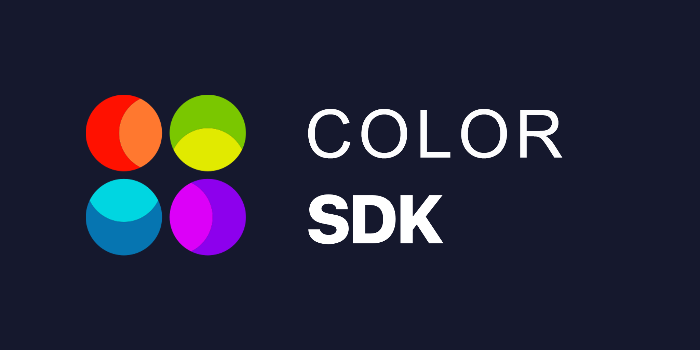

# Color SDK

The Color-SDK is a framework for building blockchain applications in Golang.
It is being used to build `Color`, the first implementation of the Color Hub.

**WARNING**: The SDK has mostly stabilized, but we are still making some
breaking changes.

**Note**: Requires [Go 1.12.1+](https://golang.org/dl/)

## Color Hub Mainnet

To run a full-node for the mainnet of the Color Hub, first [install `color`](https://rnssolution.github.io/colorprojectdocs/), then follow [the guide](https://rnssolution.github.io/colorprojectdocs/joinTestNet/).

## Quick Start

To learn how the SDK works from a high-level perspective, go to the [SDK Intro](https://rnssolution.github.io/colorprojectdocs/colord/).

If you want to get started quickly and learn how to build on top of the SDK, please follow the [SDK Application Tutorial](https://rnssolution.github.io/colorprojectdocs/colord/). You can also fork the tutorial's repo to get started building your own Color SDK application.

For more, please go to the [Color SDK Docs](https://rnssolution.github.io/colorprojectdocs/)

